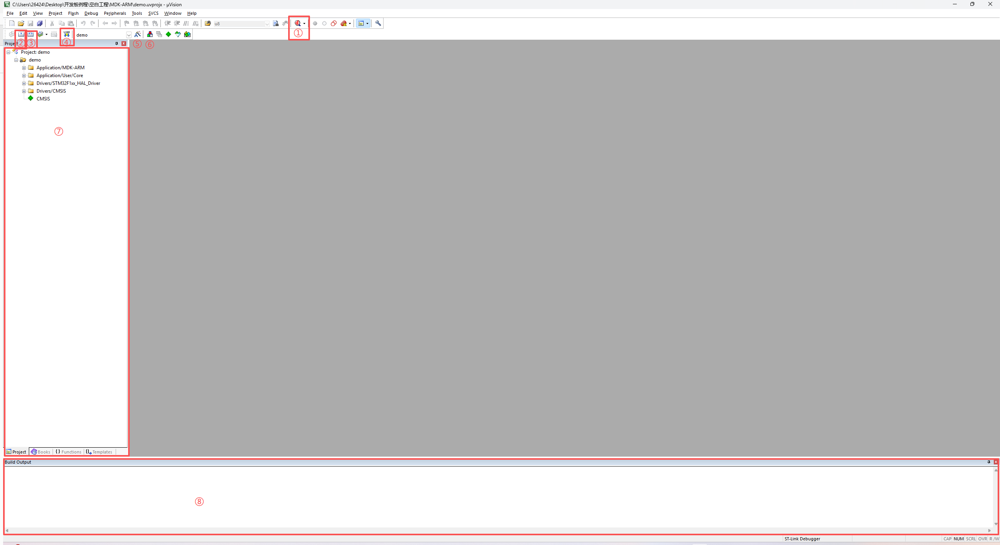

# STM32系列教程1——熟悉Keil开发环境

---

源代码链接：[下载仓库 · cc0717/STM32例程 - Gitee.com](https://gitee.com/cc0717/stm32-routine/repository/archive/master.zip) 

相关工具版本：

- STM32CubeMX：6.21.3+

- keil MDK-ARM：5.43.0.0

- C Compiler：ArmClang V6.24

---

## 一、Keil界面简介

1. 通常，首次打开 Keil 工程文件后，界面如下图所示，各区域功能说明如下：
* ① 调试模式切换

* ② 编译当前修改文件

* ③ 编译全部文件

* ④ 下载（烧录）程序

* ⑤ 工程设置选项

* ⑥ 工程目录

* ⑦ 项目组织树

* ⑧ 编译日志输出窗口

---

## 二、工程基础配置

对于首次打开的工程，在进行代码编写之前，需要完成基本配置（如编译器与调试器设置）。点击工具栏中的“工程设置”（⑤），进入配置页面。

---

## 三、编译器配置

在 “Target” 页面中，选择 ARM Compiler，建议使用 V6.24 或其他 V6.0 以上版本。

ARM 第六代编译器（AC6）基于 LLVM / Clang 架构实现（armclang），相比旧版本编译器在标准兼容性以及对 UTF-8（如中文字符）的支持方面更加完善。

---

## 四、调试器配置

进入 “Debug” 页面，选择调试器类型。本实验使用开发板自带的 CMSIS-DAP 调试器（CMSIS-DAP Debugger）。

---

## 五、调试器参数与下载配置

完成调试器选择后，点击右侧 “Settings” 按钮，进入调试器详细配置页面。

首先确认芯片已被正确识别，并检查芯片识别码（IDCODE）是否与示例或官方资料一致。不同 STMicroelectronics 的 STM32 系列芯片，其 IDCODE 各不相同。

该识别码用于调试器判断当前连接的目标芯片型号。如果识别码不一致，可能导致程序下载失败或无法正常调试。因此，在更换芯片时需特别注意核对该参数。

随后进入 “Flash Download” 子页面，勾选 “Reset and Run” 选项，使程序在下载完成后自动复位并运行。

配置完成后，点击“OK”保存并退出。

