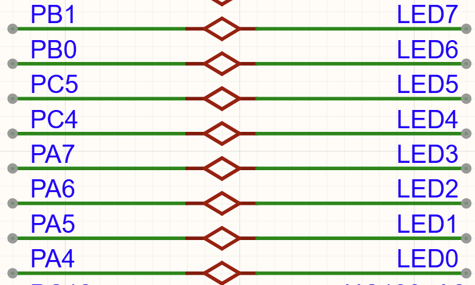
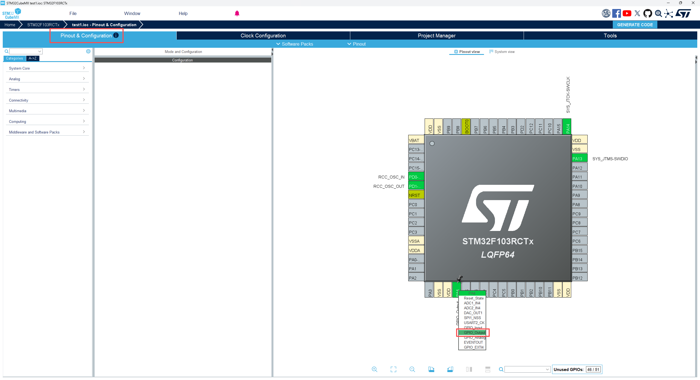
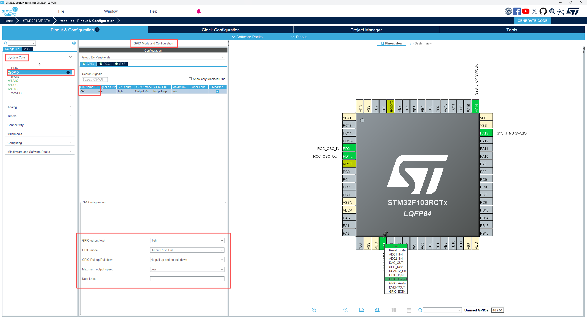

# STM32系列课程2——LED点亮与熄灭

源代码链接：[下载仓库 · cc0717/STM32例程 - Gitee.com](https://gitee.com/cc0717/stm32-routine/repository/archive/master.zip)

相关工具版本：

* STM32CubeMX：6.21.3+

* Keil MDK-ARM：5.43.0.0

* C Compiler：ArmClang V6.24

---

学习内容：

1. LED 的基本知识

2. GPIO 的配置原理及其在 CubeMX 中的配置方法

3. 使用 HAL 库控制 LED 点亮与熄灭

---

## 一、基础知识

### 1. 什么是 LED

LED（Light Emitting Diode，发光二极管）是一种半导体发光器件。当电流从阳极流向阴极时，器件内部发生电子与空穴复合，从而释放能量并以光的形式表现出来。

在正常工作范围内，LED 具有如下特性：

* 电流越大，发光亮度越高

* 当电流超过额定值时，会导致器件发热加剧，从而缩短使用寿命，严重时可能烧毁

常见的 LED 颜色包括：红色、黄色、绿色、蓝色及白色等。

### 2. LED 的压降与电流特性

LED 在正向导通时会产生一定的电压降，称为正向压降（Forward Voltage，Vf）。该参数主要由半导体材料决定，不同颜色的 LED 对应不同的压降范围。

| 颜色  | 压降范围（Vf）    | 说明        |
| --- | ----------- | --------- |
| 红色  | 1.8 – 2.2 V | 低压降       |
| 黄色  | 1.9 – 2.3 V | 接近红色      |
| 绿色  | 2.0 – 3.2 V | 分两种类型（见下） |
| 蓝色  | 2.8 – 3.5 V | 高压降       |
| 白色  | 2.8 – 3.5 V | 蓝光 LED + 荧光粉 |

说明：

* 绿色 LED存在两种类型：

  * 传统绿光：约 2.1 V

  * 新型高亮绿：约 3.0 V

* 实际设计应参考具体器件数据手册

### 3. 直插 LED 与贴片 LED

根据封装形式不同，LED 可分为直插式和贴片式（SMD）。封装形式本身不能决定正向压降或允许电流；这些参数还取决于芯片材料、器件设计和散热条件。

#### （1）直插 LED

* 常见规格：3 mm / 5 mm

* 常见工作电流：10–20 mA，具体以器件数据手册为准

* 最大允许电流由具体器件和工作条件决定，不能将 20 mA 视为所有直插 LED 的统一上限

#### （2）贴片 LED（SMD）

不同型号的电流能力差异较大。下表仅列出部分常见器件的工作电流范围，不能仅凭封装编号确定允许电流：

| 类型  | 常见封装        | 常见工作电流     |
| --- | ----------- | -------- |
| 小功率 | 0603 / 0805 | 5–20 mA  |
| 部分照明用器件 | 2835 / 3528 | 数十毫安，具体以型号为准 |
| 大功率 | 1 W 及以上 | 部分器件为 350 mA，具体以型号为准 |

### 4. 限流电阻计算

在本课使用的电阻限流电路中，LED 必须串联限流电阻，防止电流过大而损坏。采用恒流驱动时，则由驱动电路限制电流。

实际设计应根据所需亮度、散热条件和器件数据手册选择期望工作电流，不应直接按绝对最大电流设计。

忽略 GPIO 或驱动器的输出压降时，限流电阻可近似按以下公式计算：

$$
R=\frac{V_{CC}-V_f}{I}
$$

其中：

* VCC：电源电压

* Vf：LED 在目标电流下的正向压降

* I：期望工作电流，计算时应换算为安培（A）

**补充说明**

* 将工作电流取为最大允许电流的 75% 只能作为特定条件下的估算，不能作为所有 LED 的统一设计规则

* 工作电流必须同时满足 LED 与 GPIO 的电气限制；还应考虑电源电压、LED 压降、电阻阻值的偏差及电阻的功率要求

* 计算得到的电阻值通常不是标准阻值，应选择**不小于计算值的相邻标准阻值**作为最终值

---

## 二、STM32中的GPIO配置

### 1. GPIO 时钟

在 STM32F103RCT6 中，GPIO 外设的工作依赖于系统时钟，而时钟的分配与芯片内部总线结构密切相关。该系列单片机采用基于 AMBA 2.0 的片上总线架构，将内核、存储器以及各类外设连接在一起。

在这一架构中，AHB 用于连接内核、存储器和高速资源，APB 用于连接大多数片上外设。APB 又分为 APB1 和 APB2；具体外设的总线归属应以芯片参考手册中的时钟树和 RCC 寄存器说明为准。

在 STM32F103RCT6 中，GPIO 端口挂接在 APB2 上。芯片最高以 72 MHz 系统时钟运行时，APB1 最高为 36 MHz，APB2 最高为 72 MHz。APB2 时钟会影响寄存器访问，但引脚的输出边沿和可用信号速率还受到 GPIO 速度配置、负载、电源和布线等因素影响，不能只由总线频率推断。

需要注意的是，GPIO 外设在上电后其时钟默认是关闭的，必须通过复位与时钟控制器（RCC）手动开启对应端口的时钟，否则对其寄存器的访问将不会生效。因此，在进行 GPIO 配置之前，必须首先完成时钟使能操作，例如：

```c
__HAL_RCC_GPIOA_CLK_ENABLE();
```

该操作的本质，是为 APB2 总线上的 GPIO 模块提供时钟信号，使其能够正常参与系统工作。

### 2. 配置流程

在完成 GPIO 时钟使能之后，需要对引脚的工作方式进行配置。在基于 HAL 库的开发中，GPIO 的初始化主要通过 `GPIO_InitTypeDef` 结构体来实现。用户只需对结构体中的关键参数进行设置，即可完成对 GPIO 工作模式、电气特性及速度的配置。

#### 2.1 GPIO_InitTypeDef 结构体参数说明

GPIO 初始化结构体包含以下成员：

```c
typedef struct
{
  uint32_t Pin;        // 引脚号
  uint32_t Mode;       // 工作模式
  uint32_t Pull;       // 上拉/下拉
  uint32_t Speed;      // 输出速度
} GPIO_InitTypeDef;
```

各参数含义如下：

##### 2.1.1 Pin（引脚号）

在 STM32F103RCT6 中，GPIO 端口按 0～15 编号，对应 PA0～PA15、PB0～PB15 等。实际可用引脚取决于芯片封装，并非所有端口的 16 个引脚都引出。

`Pin` 参数用于指定需要初始化的引脚编号，可以选择单个引脚，也可以通过按位或（`|`）同时选择多个引脚。

其定义如下所示：

```c
#define GPIO_PIN_0                 ((uint16_t)0x0001)  /* Pin 0 selected    */
#define GPIO_PIN_1                 ((uint16_t)0x0002)  /* Pin 1 selected    */
#define GPIO_PIN_2                 ((uint16_t)0x0004)  /* Pin 2 selected    */
#define GPIO_PIN_3                 ((uint16_t)0x0008)  /* Pin 3 selected    */
#define GPIO_PIN_4                 ((uint16_t)0x0010)  /* Pin 4 selected    */
#define GPIO_PIN_5                 ((uint16_t)0x0020)  /* Pin 5 selected    */
#define GPIO_PIN_6                 ((uint16_t)0x0040)  /* Pin 6 selected    */
#define GPIO_PIN_7                 ((uint16_t)0x0080)  /* Pin 7 selected    */
#define GPIO_PIN_8                 ((uint16_t)0x0100)  /* Pin 8 selected    */
#define GPIO_PIN_9                 ((uint16_t)0x0200)  /* Pin 9 selected    */
#define GPIO_PIN_10                ((uint16_t)0x0400)  /* Pin 10 selected   */
#define GPIO_PIN_11                ((uint16_t)0x0800)  /* Pin 11 selected   */
#define GPIO_PIN_12                ((uint16_t)0x1000)  /* Pin 12 selected   */
#define GPIO_PIN_13                ((uint16_t)0x2000)  /* Pin 13 selected   */
#define GPIO_PIN_14                ((uint16_t)0x4000)  /* Pin 14 selected   */
#define GPIO_PIN_15                ((uint16_t)0x8000)  /* Pin 15 selected   */
#define GPIO_PIN_All               ((uint16_t)0xFFFF)  /* All pins selected */
```

这些宏定义的本质是**位掩码（bit mask）** 格式，每一位对应一个引脚。例如：

* `GPIO_PIN_0` 对应二进制 `0000 0000 0000 0001`

* `GPIO_PIN_1` 对应二进制 `0000 0000 0000 0010`

因此，可以通过按位或运算同时选择多个引脚，例如：

```c
GPIO_InitStruct.Pin = GPIO_PIN_5 | GPIO_PIN_6;
```

若随后调用 HAL_GPIO_Init(GPIOA, &GPIO_InitStruct)，上述配置表示同时初始化 PA5 和 PA6。Pin 只指定端口内的引脚，端口由初始化函数的第一个参数指定。

##### 2.1.2 Mode（工作模式）与 Pull（上拉/下拉/悬空）

在 STM32F103RCT6 中，`Mode` 参数用于配置 GPIO 引脚的工作方式，是 GPIO 初始化中最核心的参数。通过该参数，可以决定引脚是作为输入、输出，还是由片上外设接管（复用功能）。

从本质上看，GPIO 的工作模式是由其内部寄存器（CRL/CRH）中的控制位决定的，不同模式对应不同的电气特性和功能组合。在 HAL 库中，这些配置被封装为统一的宏定义，便于用户使用。

###### 2.1.2.1 模式分类

GPIO 的工作模式可以从功能上划分为三大类：

- 通用输入输出模式：输入模式（Input），输出模式（Output）

- 复用功能模式（Alternate Function）

- 模拟模式（Analog）

在 STM32F1 中，常用的电气配置可归纳为以下八种工作方式。HAL 还提供外部中断和事件模式，因此这里的八种方式并不涵盖全部 HAL 模式宏。

###### 2.1.2.2 GPIO 的八大工作模式

**1. 输出模式**

GPIO 的输出模式有四种，两两一组，分为推挽输出和开漏输出，以及复用推挽输出和复用开漏输出。

其程序内部定义如下：

```c
#define  GPIO_MODE_OUTPUT_PP                    0x00000001u   /*!< Output Push Pull Mode                 */
#define  GPIO_MODE_OUTPUT_OD                    0x00000011u   /*!< Output Open Drain Mode                */
#define  GPIO_MODE_AF_PP                        0x00000002u   /*!< Alternate Function Push Pull Mode     */
#define  GPIO_MODE_AF_OD                        0x00000012u   /*!< Alternate Function Open Drain Mode    */
```

推挽输出（GPIO_MODE_OUTPUT_PP）通过 MCU 内部的上拉和下拉晶体管，主动输出接近 VDD 的高电平或接近 VSS 的低电平，常用于 LED 控制和普通数字输出。实际输出电压会随负载电流变化，允许电流还受到单引脚和芯片总电流限制，不能将 20 mA 作为所有引脚都适用的设计值。具体限制应查阅数据手册。

开漏输出（GPIO_MODE_OUTPUT_OD）与推挽输出不同，其输出驱动仅使用下拉晶体管，当输出低电平时，由 MCU 主动拉低引脚；而当需要输出高电平时，下拉管关闭，引脚处于高阻态，此时电平由外部上拉电阻决定。

这种结构的特点是：

* 只能主动输出低电平，高电平依赖外部电路

* 可实现“线与”（wired-AND）功能

* 支持多个设备共享同一信号线

复用功能模式包括复用推挽输出（GPIO_MODE_AF_PP）和复用开漏输出（GPIO_MODE_AF_OD）。与普通输出模式不同，这两种模式下 GPIO 引脚的控制权不再由 CPU 直接操作，而是交由片上外设（如串口、SPI、I2C、定时器等）接管。

其中，“推挽”与“开漏”的电气特性与前述普通输出模式完全一致，因此不再赘述。复用模式的核心在于：**GPIO 从通用 I/O 转变为专用外设接口引脚**。

在复用推挽输出（GPIO_MODE_AF_PP）模式下，引脚由外设驱动，并采用推挽结构输出信号，具有驱动能力强、速度快的特点，适用于大多数数字通信接口，如串口发送（USART_TX）、SPI 时钟（SCK）等。

在复用开漏输出（GPIO_MODE_AF_OD）模式下，引脚同样由外设控制，但输出结构为开漏形式，需依赖外部上拉电阻形成高电平。该模式主要用于需要“线与”特性的通信接口，例如 I2C 总线中的 SDA 和 SCL 信号。

需要理解的是，复用模式的本质是**功能复用**：同一个物理引脚可以在不同配置下承担不同外设功能，这也是 STM32 引脚资源复用能力的重要体现。因此，开漏输出常用于总线型通信场合，如 I2C 等需要多设备协同工作的场景。

**2. 输入模式**

GPIO 的常用输入模式包括上拉输入、下拉输入、悬空输入以及模拟输入四种。这四种输入方式由 `Mode` 与 `Pull` 参数共同配置实现。

对于 USART_RX 等外设输入引脚，STM32F1 通常按照外设要求配置为浮空输入或上拉输入；具体配置应查阅对应外设章节和数据手册中的引脚说明。

其程序内部定义如下：

```c
#define  GPIO_MODE_INPUT                        0x00000000u   /*!< Input Floating Mode                   */
#define  GPIO_MODE_ANALOG                       0x00000003u   /*!< Analog Mode  */

#define  GPIO_NOPULL        0x00000000u   /*!< No Pull-up or Pull-down activation  */
#define  GPIO_PULLUP        0x00000001u   /*!< Pull-up activation                  */
#define  GPIO_PULLDOWN      0x00000002u   /*!< Pull-down activation                */
```

在输入模式下，GPIO 引脚主要用于采集外部信号，其电气特性由内部是否连接上拉或下拉电阻决定。根据 `Mode` 与 `Pull` 参数的不同组合，可以形成以下四种常用输入方式。

悬空输入（GPIO_MODE_INPUT + GPIO_NOPULL）是指引脚既不连接上拉电阻，也不连接下拉电阻，此时引脚处于高阻态，其电平完全由外部信号决定。当引脚未连接有效信号源时，电平容易受到外界干扰而发生随机变化，因此一般仅在外部电路已经提供稳定驱动的情况下使用。

上拉输入（GPIO_MODE_INPUT + GPIO_PULLUP）是在引脚内部接入上拉电阻，使引脚在无外部输入时默认保持高电平。当外部电路将引脚拉低时，输入状态发生改变。该模式可避免未驱动时的输入悬空，常用于按键输入和电平检测；实际抗干扰效果仍取决于布线、上拉阻值及外部电路。

下拉输入（GPIO_MODE_INPUT + GPIO_PULLDOWN）是在引脚内部接入下拉电阻，使引脚在无外部输入时默认保持低电平。当外部输入为高电平时，引脚状态发生变化。该模式适用于需要默认低电平的输入场合，其原理与上拉输入类似。

模拟输入（GPIO_MODE_ANALOG）用于关闭数字输入缓冲器并使数字输出驱动处于高阻态。对于支持 ADC 等模拟功能的引脚，还需配置对应模拟外设才能采集信号。在该模式下，引脚不参与数字逻辑判断，从而有效降低功耗，并减少数字电路对模拟信号的干扰。因此，在进行模数转换或低功耗设计时，应优先选择该模式。

###### 2.1.2.3 配置示例

以下代码片段展示各工作方式的配置。在 STM32F1 中，Pull 主要用于数字输入配置；输出模式中设置 GPIO_PULLUP 并不能代替开漏输出所需的外部上拉电阻。

**1. 推挽输出**

```c
GPIO_InitStruct.Mode = GPIO_MODE_OUTPUT_PP;
GPIO_InitStruct.Pull = GPIO_NOPULL;
```

**2. 开漏输出**

```c
GPIO_InitStruct.Mode = GPIO_MODE_OUTPUT_OD;
GPIO_InitStruct.Pull = GPIO_NOPULL;   // 如需输出高电平，通常需外接上拉电阻
```

**3. 复用推挽输出**

```c
GPIO_InitStruct.Mode = GPIO_MODE_AF_PP;
GPIO_InitStruct.Pull = GPIO_NOPULL;
```

**4. 复用开漏输出**

```c
GPIO_InitStruct.Mode = GPIO_MODE_AF_OD;
GPIO_InitStruct.Pull = GPIO_NOPULL;   // 如需输出高电平，通常需外接上拉电阻
```

**5. 悬空输入**

```c
GPIO_InitStruct.Mode = GPIO_MODE_INPUT;
GPIO_InitStruct.Pull = GPIO_NOPULL;
```

**6. 上拉输入**

```c
GPIO_InitStruct.Mode = GPIO_MODE_INPUT;
GPIO_InitStruct.Pull = GPIO_PULLUP;
```

**7. 下拉输入**

```c
GPIO_InitStruct.Mode = GPIO_MODE_INPUT;
GPIO_InitStruct.Pull = GPIO_PULLDOWN;
```

**8. 模拟输入**

```c
GPIO_InitStruct.Mode = GPIO_MODE_ANALOG;
GPIO_InitStruct.Pull = GPIO_NOPULL;
```

##### 2.1.3 Speed（输出速度）

在完成 GPIO 工作模式配置后，对于输出模式或复用模式，还需要进一步配置引脚的输出速度参数。`Speed` 参数用于控制 GPIO 引脚的驱动能力和电平翻转速度，是影响信号质量的重要因素之一。

在 STM32F103RCT6 中，GPIO 的输出速度本质上对应的是引脚内部驱动电路的响应能力，其程序定义如下：

```c
#define GPIO_SPEED_FREQ_LOW       0x00000002u   /*!< Low speed      */
#define GPIO_SPEED_FREQ_MEDIUM    0x00000001u   /*!< Medium speed   */
#define GPIO_SPEED_FREQ_HIGH      0x00000003u   /*!< High speed     */
```

需要注意的是，这里的“速度”并非指信号的通信速率，而是指 GPIO 输出电平从低到高或从高到低的变化速度（即上升沿和下降沿的快慢）。

###### 2.1.3.1 速度等级说明

在 STM32F1 系列中，GPIO 输出速度通常对应以下三个等级：

* 低速（Low Speed）：约 2 MHz

* 中速（Medium Speed）：约 10 MHz

* 高速（High Speed）：约 50 MHz

这里的 MHz 是 STM32F1 对输出模式速度等级的标称值，主要反映输出驱动与边沿速度，并不保证引脚能够在相同频率下稳定输出方波。实际可用速率还取决于负载、电源、布线和信号完整性。

###### 2.1.3.2 Speed 参数的作用

GPIO 输出速度主要影响以下几个方面：

**① 信号上升沿/下降沿速度**

速度越高，引脚电平变化越快，适用于高速数字信号输出。

**② 驱动能力**

速度等级会影响驱动器对电容负载的充放电能力，但不意味着可以提高 GPIO 的允许直流输出电流。负载仍须满足数据手册要求。

**③ 电磁干扰（EMI）**

速度越高，信号边沿越陡，可能带来更强的电磁干扰。

###### 2.1.3.3 实际使用建议

在实际应用中，应根据具体需求合理选择 GPIO 输出速度：

| 应用场景           | 推荐速度  |
| -------------- | ----- |
| LED 控制         | 低速或中速 |
| 普通 I/O 输出         | 中速    |
| 高速通信（SPI、时钟信号） | 高速    |

一般情况下，不建议默认全部配置为高速模式，以避免不必要的功耗增加和电磁干扰问题。

###### 2.1.3.4 配置示例

```c
GPIO_InitStruct.Speed = GPIO_SPEED_FREQ_HIGH;
```

该配置表示将 GPIO 引脚设置为高速输出模式，适用于对响应速度要求较高的场景。

#### 2.2 GPIO 初始化的使用方法（HAL_GPIO_Init）

在前一节中，我们已经介绍了 GPIO 配置所需的各项参数（`Pin`、`Mode`、`Pull`、`Speed`）。在实际开发中，这些参数需要组合使用，并通过 `HAL_GPIO_Init` 函数完成初始化配置。

GPIO 初始化的基本使用流程如下。

##### 2.2.1 定义初始化结构体

```c
GPIO_InitTypeDef GPIO_InitStruct = {0};
```

该结构体用于存放 GPIO 的各项配置参数。

##### 2.2.2 配置引脚及工作模式

根据实际需求，对结构体成员进行赋值。例如配置 PA5 为推挽输出：

```c
GPIO_InitStruct.Pin = GPIO_PIN_5;
GPIO_InitStruct.Mode = GPIO_MODE_OUTPUT_PP;
GPIO_InitStruct.Pull = GPIO_NOPULL;
GPIO_InitStruct.Speed = GPIO_SPEED_FREQ_LOW;
```

##### 2.2.3 调用初始化函数

```c
HAL_GPIO_Init(GPIOA, &GPIO_InitStruct);
```

执行该函数后，相关配置将写入 GPIO 寄存器，引脚开始按照设定方式工作。

##### 2.2.4 完整示例

```c
GPIO_InitTypeDef GPIO_InitStruct = {0};

/* 1. 开启GPIOA时钟 */
__HAL_RCC_GPIOA_CLK_ENABLE();

/* 2. 配置引脚参数 */
GPIO_InitStruct.Pin = GPIO_PIN_5;
GPIO_InitStruct.Mode = GPIO_MODE_OUTPUT_PP;
GPIO_InitStruct.Pull = GPIO_NOPULL;
GPIO_InitStruct.Speed = GPIO_SPEED_FREQ_LOW;

/* 3. 初始化GPIO */
HAL_GPIO_Init(GPIOA, &GPIO_InitStruct);

```

---

## 三、在 CubeMX 中配置 GPIO

第二部分介绍了 GPIO 的配置参数及其代码实现。

本节使用 CubeMX 完成 GPIO 引脚的图形化配置，并说明配置项与代码之间的对应关系。

如何创建 CubeMX 工程及完成基本系统配置，已在《STM32系列课程0》中介绍，这里不再重复。

实验使用的教学板预装了 8 个 LED，本课以 LED1（PA4）为例。

本课按 PCB 丝印称呼 LED：LED1 对应 PA4。需要注意，原理图中的网络标签为 LED0，与 PCB 丝印编号错开一位；下图中的 LED1 网络标签则对应 PA5。



因此，需要在 CubeMX 中配置 PA4，步骤如下：

1. 在 Pinout & Configuration 页面的芯片引脚图中找到 PA4，单击该引脚并选择 GPIO_Output，如下图所示。



2. 在左侧展开 System Core，单击 GPIO。进入 GPIO Mode and Configuration 配置区域，选中 PA4，并按下图设置参数。



四个配置项的含义如下：

| 名称                     | 内容                          | 含义                |
| ---------------------- | --------------------------- | ----------------- |
| GPIO output level      | High                        | GPIO 初始化时将输出设为高电平        |
| GPIO mode              | Output Push Pull            | 设置 GPIO 工作模式为推挽输出模式 |
| GPIO Pull-up/Pull-down | No Pull-up and no Pull-down | 不启用内部上拉或下拉       |
| Maximum output speed   | Low                         | GPIO 工作在低速模式       |

本课采用低电平点亮 LED 的接法，因此初始输出设为 High，可使 LED 在 GPIO 初始化完成后保持熄灭。完成配置后，生成工程并在 Keil 中打开。

---

## 四、在 Keil 中编写控制代码

### 1. GPIO 电平与 LED 状态

本课所用 LED 控制电路中，GPIO 连接在 LED 阴极一侧。因此，PA4 输出低电平时，LED1 点亮；PA4 输出高电平时，LED1 熄灭。

### 2. 设置 GPIO 输出电平

HAL 库通过以下函数设置 GPIO 的输出电平：

```c
void HAL_GPIO_WritePin(GPIO_TypeDef *GPIOx, uint16_t GPIO_Pin, GPIO_PinState PinState);
```

三个参数分别表示 GPIO 端口、引脚位掩码和目标输出状态：GPIO_PIN_RESET 将输出设为低电平，GPIO_PIN_SET 将输出设为高电平。该函数可执行置位或复位操作，具体由 PinState 决定。

引脚配置为通用输出后，设置一次电平即可保持该状态，直到后续代码修改输出或芯片复位，无需在循环中反复写入。

### 3. 点亮 LED

在 main 函数中，GPIO 初始化完成后的 2 号用户代码区添加以下代码。将代码放在用户代码区，并确保 CubeMX 的 Keep User Code when re-generating 选项已启用，可在重新生成代码时保留该段代码。

```c
/* USER CODE BEGIN 2 */
HAL_GPIO_WritePin(GPIOA, GPIO_PIN_4, GPIO_PIN_RESET);
/* USER CODE END 2 */
```

完成编译并下载程序后，即可观察到 PCB 丝印标为 LED1 的 LED 点亮。

### 4. 熄灭 LED

若要让 LED 保持熄灭，将上述调用中的 GPIO_PIN_RESET 改为 GPIO_PIN_SET：

```c
/* USER CODE BEGIN 2 */
HAL_GPIO_WritePin(GPIOA, GPIO_PIN_4, GPIO_PIN_SET);
/* USER CODE END 2 */
```

重新编译并下载程序后，LED 将保持熄灭。这是与点亮代码分开使用的示例；若连续执行两条语句，最终输出为高电平，LED 处于熄灭状态。
